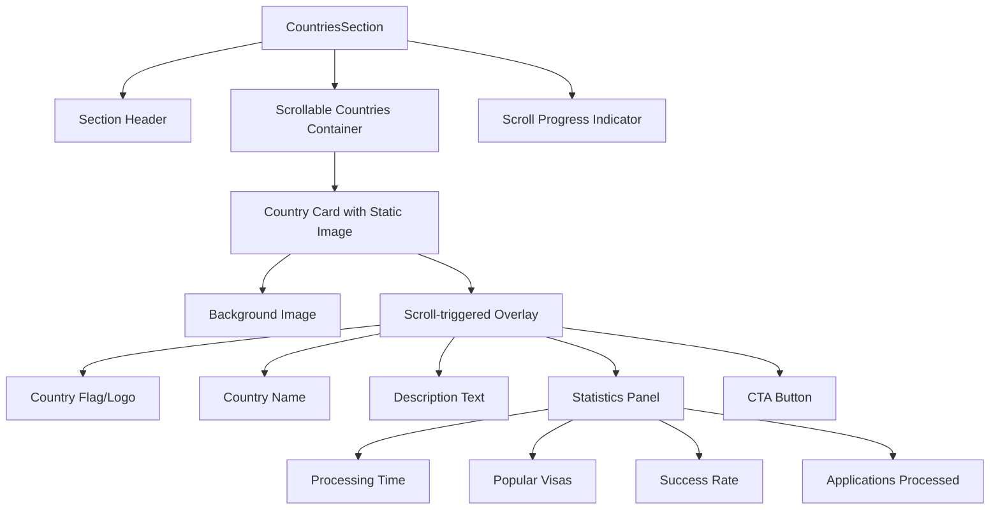

# Countries Section Redesign - Flexy.global Case Studies Style

## Overview

This design document outlines the redesign of the CountriesSection component to match the UI/UX patterns from Flexy.global's case studies section. The redesign transforms the current vertical scrollable countries grid into a sophisticated case study-style presentation that showcases destination countries as professional portfolio items.

## Architecture

### Current vs New Design Comparison

**Current Design:**
- Vertical scrollable container with 2-column grid
- Static image placeholders with overlay text
- Basic hover animations for country cards
- Modal popup for detailed country information

**New Design (Flexy.global inspired):**
- Scroll-triggered animations within the section
- Content reveals and animates as user scrolls vertically
- Static images with animated overlay content
- Progressive content disclosure based on scroll position
- Professional case study presentation without modal interruptions

### Component Structure



### Scroll-Based Animation Pattern

The design follows Flexy.global's scroll-triggered animation approach:
- **Vertical scroll within section**: Content animates in as user scrolls down
- **Static image with overlay**: Text content overlays images with smooth animations
- **Progressive revelation**: Information appears sequentially based on scroll position
- **Staggered animations**: Each country card animates with slight delays
- **Smooth transitions**: All content changes happen within the same section view

## Country Card Design Specification

### Visual Structure

Each country card will follow this scroll-animated layout structure:

```
┌─────────────────────────────────────────────────────────────┐
│                                                             │
│                    HERO IMAGE                               │
│                                                             │
│    ┌─ ANIMATED OVERLAY (appears on scroll) ─┐               │
│    │  [FLAG] COUNTRY NAME                   │               │
│    │  Brief description of benefits         │               │
│    │                                        │               │
│    │  ┌─ PROCESSING TIME: X months          │               │
│    │  ├─ POPULAR VISAS: Type1, Type2        │               │
│    │  └─ SUCCESS RATE: XX%                  │               │
│    │                                        │               │
│    │  [Learn More Button]                   │               │
│    └────────────────────────────────────────┘               │
└─────────────────────────────────────────────────────────────┘
```

### Typography System

Following the project's established typography hierarchy:

- **Country Name**: `font-poppins font-bold text-2xl md:text-3xl text-[#0D2F5B]`
- **Description**: `font-lato text-lg text-[#64748B]`
- **Statistics**: `font-poppins font-semibold text-base text-[#0D2F5B]`
- **Metrics Numbers**: `font-poppins font-bold text-xl text-[#D4AF37]`

### Color Scheme

Maintaining consistency with the existing design system:
- **Primary Blue**: `#0D2F5B` (Country names, headings)
- **Gold Accent**: `#D4AF37` (Statistics, highlights, CTAs)
- **Text Gray**: `#64748B` (Descriptions, secondary text)
- **Background**: `#FFFFFF` and `#F8FAFC` (alternating card backgrounds)

## Animation Strategy

### Entrance Animations

Following Flexy.global's smooth, professional animation style:

```tsx
// Scroll-based overlay animation
const overlayVariants = {
  hidden: { opacity: 0, y: 40 },
  visible: {
    opacity: 1,
    y: 0,
    transition: {
      duration: 0.6,
      ease: "easeOut"
    }
  }
};

// Sequential text reveal within overlay
const textSequenceVariants = {
  hidden: { opacity: 0, x: -20 },
  visible: (index: number) => ({
    opacity: 1,
    x: 0,
    transition: {
      duration: 0.5,
      delay: index * 0.1,
      ease: "easeOut"
    }
  })
};

// Parallax background image
const parallaxVariants = {
  offscreen: { y: 0 },
  onscreen: {
    y: -50,
    transition: {
      duration: 1.5,
      ease: "easeOut"
    }
  }
};
```

### Hover Interactions

- **Image hover**: Subtle parallax movement continues
- **Overlay hover**: Enhanced shadow and slight scale effect
- **Button hover**: Background color transition with gentle glow
- **Statistics hover**: Number highlighting with color accent
- **Card hover**: Minimal interaction to maintain scroll focus

### Scroll-triggered Animations

Using Framer Motion's `whileInView` and scroll-based animations:
- **Overlay content fades in** when card enters viewport
- **Text elements animate sequentially** (country name → description → statistics)
- **Parallax effect** on background images as user scrolls
- **Statistics counter animation** when statistics become visible
- **Smooth transitions** between different scroll positions within the section
- **Scroll progress indicator** for the countries section itself

## Data Structure Enhancement

### Enhanced Country Data Model

```typescript
interface CountryData {
  id: number;
  name: string;
  tagline: string; // Short compelling tagline
  description: string; // Detailed description
  heroImage: string; // Background image for the card
  flagIcon: string;
  statistics: {
    processingTime: string;
    popularVisas: string[];
    successRate: string;
    applicantsProcessed: string;
  };
  quickFacts: string[];
  overlayPosition: 'bottom-left' | 'bottom-right' | 'center'; // Where overlay appears
  animationDelay: number; // Stagger animation timing
  testimonial?: {
    quote: string;
    author: string;
    position: string;
  };
}
```

### Sample Data Structure

```typescript
const countries: CountryData[] = [
  {
    id: 1,
    name: 'Canada',
    tagline: 'Your pathway to North American excellence',
    description: 'Experience world-class healthcare, exceptional education systems, and a multicultural society that welcomes global talent with open arms.',
    heroImage: '/images/countries/canada-hero.jpg',
    flagIcon: '/images/flags/canada.svg',
    statistics: {
      processingTime: '6-12 months',
      popularVisas: ['Express Entry', 'PNP', 'Family Class'],
      successRate: '89%',
      applicantsProcessed: '15K+'
    },
    quickFacts: [
      'Free healthcare system',
      'Pathway to citizenship in 3 years',
      'High quality of life index'
    ],
    overlayPosition: 'bottom-left' // Controls where overlay appears
  }
  // ... other countries with varying overlay positions
];
```

## Responsive Design Implementation

### Breakpoint Strategy

Following the project's mobile-first approach:

- **Mobile (sm)**: Single column grid, full-width cards with overlay at bottom
- **Tablet (md)**: 2-column grid with responsive overlay positioning
- **Desktop (lg+)**: 2-3 column grid with varied overlay positions

### Mobile Optimization

```tsx
// Mobile-optimized scroll layout
<div className="grid grid-cols-1 md:grid-cols-2 lg:grid-cols-3 gap-6 h-[80vh] overflow-y-auto">
  {countries.map((country, index) => (
    <motion.div
      key={country.id}
      className="relative rounded-xl overflow-hidden h-64 md:h-80"
      whileInView="visible"
      initial="hidden"
      viewport={{ once: false, amount: 0.3 }}
    >
      {/* Background Image */}
      <motion.div 
        className="absolute inset-0 bg-cover bg-center"
        style={{ backgroundImage: `url(${country.heroImage})` }}
        variants={parallaxVariants}
      />
      
      {/* Scroll-triggered Overlay */}
      <motion.div
        className={`absolute inset-0 bg-gradient-to-t from-black/80 via-transparent to-transparent`}
        variants={overlayVariants}
      >
        {/* Overlay content */}
      </motion.div>
    </motion.div>
  ))}
</div>
```

### Touch Interactions

- Larger touch targets for mobile (minimum 44px)
- Swipe gestures for mobile card navigation
- Reduced hover effects on touch devices

## Performance Optimization

### Image Loading Strategy

```tsx
// Optimized image loading with Next.js Image component
import Image from 'next/image';

<Image
  src={country.heroImage}
  alt={`${country.name} immigration`}
  width={600}
  height={400}
  className="object-cover rounded-xl"
  loading="lazy"
  placeholder="blur"
  blurDataURL="data:image/jpeg;base64,..."
/>
```

### Animation Performance

- Use `transform` properties for animations (GPU accelerated)
- Implement `will-change: transform` for frequently animated elements
- Lazy load animations using Intersection Observer
- Debounced scroll events for smooth performance

## Accessibility Implementation

### WCAG Compliance

- **Keyboard Navigation**: Full tab navigation support
- **Screen Reader Support**: Proper ARIA labels and descriptions
- **Color Contrast**: Minimum 4.5:1 ratio for all text
- **Focus Management**: Visible focus indicators

### Accessibility Features

```tsx
// Example accessibility implementation
<section
  aria-labelledby="countries-heading"
  className="py-20 bg-white"
>
  <h2 id="countries-heading" className="sr-only">
    Immigration destination countries
  </h2>
  
  <div
    role="list"
    aria-label="Available immigration destinations"
  >
    {countries.map((country, index) => (
      <article
        key={country.id}
        role="listitem"
        aria-labelledby={`country-${country.id}-name`}
        className="country-card"
      >
        <h3 id={`country-${country.id}-name`}>
          {country.name}
        </h3>
        {/* Rest of card content */}
      </article>
    ))}
  </div>
</section>
```

## Implementation Phases

### Phase 1: Core Structure
1. Update data structure and TypeScript interfaces
2. Implement basic alternating layout
3. Add country flag/logo integration
4. Implement responsive breakpoints

### Phase 2: Visual Enhancement
1. Add professional styling and spacing
2. Implement statistics display
3. Add background variations
4. Create consistent visual hierarchy

### Phase 3: Animations & Interactions
1. Implement entrance animations
2. Add hover states and micro-interactions
3. Create scroll-triggered animations
4. Add mobile touch interactions

### Phase 4: Performance & Accessibility
1. Optimize image loading and performance
2. Implement accessibility features
3. Add keyboard navigation
4. Test across devices and browsers

## Testing Strategy

### Visual Testing
- Cross-browser compatibility testing
- Responsive design validation
- Animation performance testing
- Accessibility audit

### User Experience Testing
- Navigation flow testing
- Mobile touch interaction testing
- Performance benchmarking
- Screen reader compatibility

### Component Testing
- Unit tests for data transformation
- Integration tests for animations
- Visual regression testing
- Performance monitoring

The redesigned CountriesSection will provide a professional, engaging experience that matches the sophisticated design standards of Flexy.global while maintaining the immigration-focused content and functionality required for the landing page.